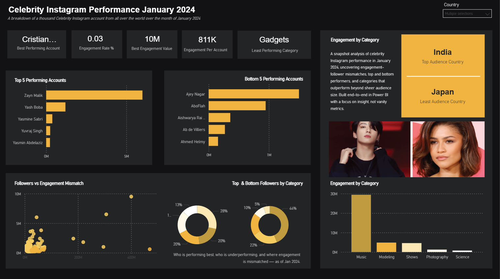
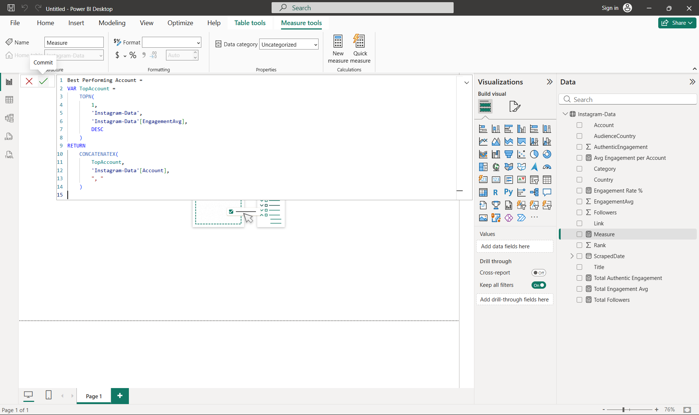
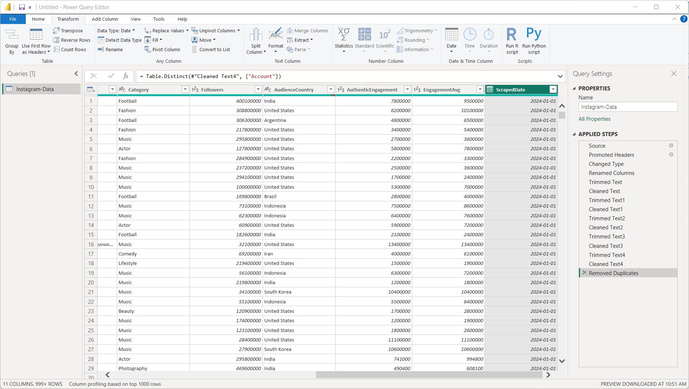
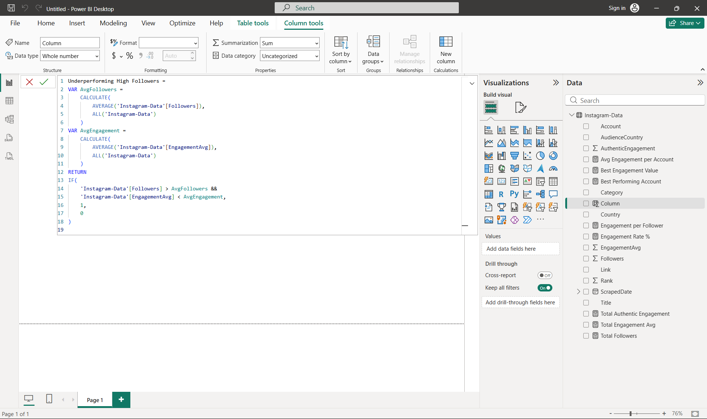

# 2024 Celebrity Instagram Performance Dashboard (Power BI)


## Overview
This project is a **one-tool Power BI build**—from **cleaning → modeling → DAX → visualization**—to demonstrate **tool mastery** and end-to-end dashboard delivery using **free Power BI Desktop**.

The original dataset was sourced from **Alex The Analyst’s Power BI for BI Analytics course**, but I approached it like a real client-style analysis: defining business questions upfront, sketching the layout, cleaning what was possible, and designing an executive-ready experience.

> **Snapshot scope:** The dataset represents a **January 2024 snapshot** (not a time series), so insights focus on **performance distribution, ranking, and engagement efficiency** rather than trends.

---

## Project Goals
- Build an end-to-end BI project **entirely in Power BI**
- Demonstrate:
  - **Power Query** transformations
  - **DAX measures** for KPIs, ranking, and flags
  - Strong **data storytelling & executive UI**
- Stress-test what’s feasible **without** SQL/Python (and learn the tradeoffs)

---

## Tools Used
- **Power BI Desktop** (Power Query + DAX + Visuals)
- **Excel (light cleanup)** — minor edits like name formatting and Instagram handle cleanup
- **Adobe Illustrator** — background + layout styling
- **Canva vectors** — supporting UI assets
- **Sketchbook** — early layout planning & insight mapping
- **VS Code + GitHub** — version control and documentation

---

## Dashboard Pages & Highlights

### Page 1 — Executive Snapshot
- Best Performing Account (KPI)
- Engagement Rate % (KPI)
- Highest Avg Engagement (KPI)
- Avg Engagement per Account (KPI)
- Top 5 vs Bottom 5 Performing Accounts
- Followers vs Engagement mismatch scatter (identify “big reach / low engagement” accounts)
- Engagement by Category

**Screenshots**
- Main (with drill):  
  
- Main:  
  

---

### Page 2 — Deep Dive Insights
- Top vs least performing **Audience Country** (KPI)
- Engagement composition (Authentic vs Avg)
- Followers vs Engagement distribution donuts
- Category vs Account comparisons
- Drillthrough-style detail table for account-level context

**Screenshots**
- Page 2 (with drill):  
  
- Page 2:  
  

---

## Data Cleaning Notes (Reality Check)
Although the goal was “Power BI-only,” I quickly realized a real-world truth:

✅ **Power Query is powerful**  
⚠️ But doing *heavy cleaning entirely in Power Query* can be **cumbersome** and **limited** compared to **SQL/Python/Excel**—especially for complex transformations and large datasets.

### What was cleaned
- Standardized fields (names, handles, category formatting)
- Correct data types (followers, engagement, dates)
- Text cleanup (trim/clean)
- Removed duplicates where needed
- Built calculated engagement fields used across visuals

**Cleaning Screenshots**
- Excel cleanup snapshots:
  
  
  

- DAX + Power Query view:
  

---

## Key Business Questions Answered
1. **Which accounts drive the highest engagement (Top performers)?**  
   - Ranked using DAX measures and filtered visuals

2. **Who are the lowest performers (Bottom performers)?**  
   - Dynamic bottom ranking to surface underperformers

3. **Is follower size translating to engagement?**  
   - Scatter plot reveals **mismatch zones** (high followers / low engagement)

4. **Which categories outperform beyond follower scale?**  
   - Category-level comparisons + distribution donuts

5. **Where is the audience strongest geographically?**  
   - Top/least audience countries surfaced via KPIs

---

## Limitations & What Better Granularity Would Unlock
A major challenge: the dataset wasn’t sufficiently **granular** for content-level performance.

Missing fields (examples):
- Post type (**reels**, stories, carousel, image)
- Likes/comments per post
- Posting day/time (day of week, hour posted)
- Post-level reach, impressions, saves, shares
- Engagement by post format

### Why granularity matters
When you only have account-level snapshot data, you can identify **who** performs well—but not always **why**.

With the right granularity, we could analyze:
- Best post formats for engagement (reels vs carousel, etc.)
- Like/comment behavior by post type
- Posting time optimization (day/time)
- Content strategy recommendations based on measurable patterns

**Takeaway:** collecting the *right* level of granularity dramatically increases insight outcomes.

---

## Core DAX Measures (Examples)
Below are a few of the core measures used to power the KPIs and visuals:

### Total Followers
```DAX
Total Followers =
SUM('Instagram-Data'[Followers])
```

### For more connect with me on LinkedIn:
https://www.linkedin.com/in/iyanu-adebara-5a62a0103/
